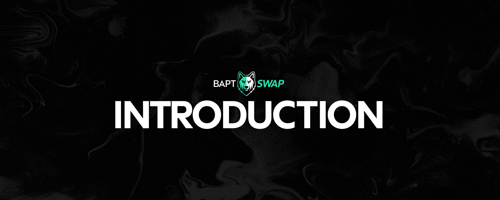

# 👋 Introduction to Baptswap

<figure><figcaption></figcaption></figure>

## Overview

Baptswap is a Decentralized Exchange (DEX) operating on the Aptos Network, enabling peer-to-peer cryptocurrency exchanges without the need for trusted intermediaries. It is unique in its support for fee-on-transfer solutions within a MOVE-based blockchain environment.

## Key Features

**Secure and Permissionless**: Designed for open access without restrictions based on geography, wealth, or status.

**Innovative Use of MOVE**: The first and only protocol on MOVE-based blockchains to offer EVM-like features with the flexibility of the MOVE language.

**Versioning**: Baptswap has evolved from V1 to V2, with V1 now discontinued. V2 operates with 100% uptime, dependent on the Aptos Network's continuity.

## Baptswap vs. Traditional Markets

### Automated Market Maker (AMM)

* **Difference from Order Books**: Unlike central limit order book-based exchanges, Baptswap uses an AMM model. This replaces buy and sell orders with a liquidity pool of two assets, dynamically determining market rates as assets are traded.
* **Direct Trading with the Pool**: Traders interact directly with the liquidity pool rather than individual orders.
* **Research and Development**: The AMM model's advantages and disadvantages are the subject of ongoing research and innovation.

## Permissionless System

* **Open Access**: Baptswap's design ensures unrestricted public use, allowing anyone to swap, provide liquidity, or create markets.
* **Immutable Design**: The protocol operates without the possibility of pausing contracts, reversing trades, or altering its behavior.
* **Governance and Fee Structure**: The upcoming Baptswap Governance will have the authority to modify swap fees, with limits set between 0% and 0.9% to prevent abuse.

## Additional Resources

### Comparative Analysis

For insights on how Baptswap stands out among other AMMs on Aptos, visit [Baptswap's Unique Features](introduction-to-baptswap/made-to-stand-out.md).

### Research and Development

To delve into the economics of AMMs, game theory, and optimization, keep an eye on our upcoming Research Page (Coming Soon).

### V2 Enhancements

Discover the new features and improvements in V2 that refine the AMM design on the [V2 Concepts Page](https://chat.openai.com/c/71bdf716-0593-4300-be09-4f24e0c5fd4f).
