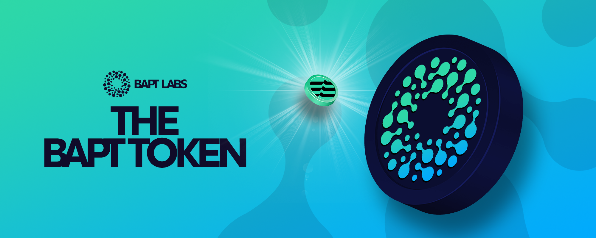

# 🪙 The BAPT Token

<figure><figcaption></figcaption></figure>

BAPT is the native token that powers the Baptswap ecosystem, a cornerstone for a new type of token trading on Aptos

Earn BAPT by providing LP and in the Reward Pools, or [buy it on the exchange](https://baptswap.com/swap), then explore its use cases:

* Stake it in the [Pools](https://baptswap.com/staking-pools) to earn free tokens from its trading volume.
* Vote in governance proposals (future implementation).

## Token Info

### Contract:

Aptos Mainnet: `0x::BAPT::BAPT`

### Token Name:

* BAPT

### Symbol:

* BAPT

### Decimals:

* 8

### Max Supply:

* 1,000,000,000.00

But that's not all - there's much more on the horizon for BAPT, soon to be released!

## Further Details

Check below to discover in details how BAPT works:


[tokenomics](../../governance/tokenomics/)

