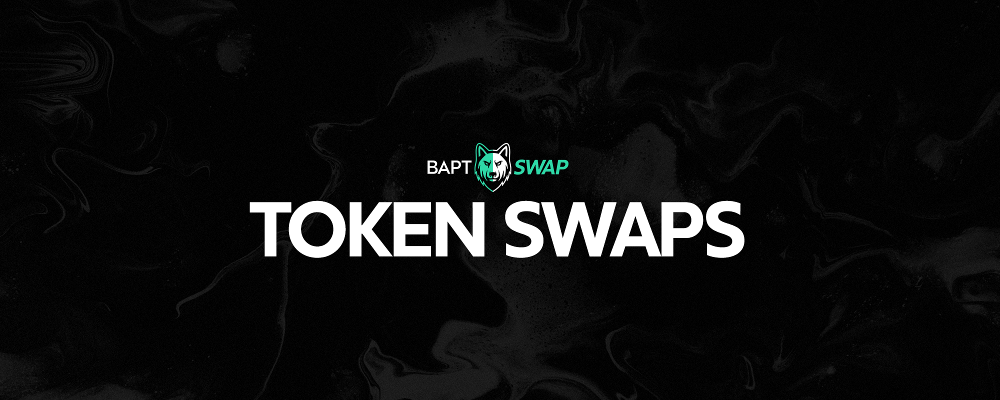

# 🔄 Exchange

<figure><figcaption></figcaption></figure>

## Introduction

Baptswap facilitates seamless swaps on the Aptos Network, allowing users to trade tokens in a straightforward and permissionless manner. This guide explains the key aspects of swapping tokens using the Baptswap protocol.

## Understanding Swaps on Baptswap

### Basic Swap Mechanism

* **Process**: Users select a token they own and a token they wish to acquire.
* **Execution**: The swap sells owned tokens for the desired tokens, minus the swap fee (awarded to liquidity providers) and any Fee-on-Transfer Taxes, if applicable.

### Protocol vs. Web Interface

**Note**: Swapping via web interfaces may introduce additional permission structures and differ in execution behavior from using the Baptswap protocol directly. For more details, see [What is Baptswap](../../).

### Automated Market Maker (AMM) Model

Swaps on Baptswap are executed against a pool of liquidity, not on a first-in-first-out basis like traditional order book trades.

Liquidity providers earn fees proportional to their capital commitment. Learn more about Fees on Baptswap.

## Key Considerations in Swapping

### Price Impact

#### **Definition**

Price impact is the change in execution price due to the size of the market order against available liquidity.

#### **AMM Dynamics**

The relative value of assets shifts continuously during a swap, affecting the final execution price.

#### **Liquidity and Price Impact**

The amount of liquidity at different price points influences the price impact. More liquidity equals lower price impact, and vice versa.

#### **Interface Display**

The Baptswap interface provides real-time estimates of price impact and warnings for unusually high impacts.

### Slippage

#### **Definition**

Slippage refers to price changes that occur while a transaction is pending.

#### **Gas Fee and Execution Order**

The amount of gas fee influences the transaction's execution speed. Lower gas fees can lead to longer pending times and potential price changes.

#### **Slippage Tolerance**

Users set a slippage range within which the transaction will execute. Transactions fail if the execution price falls outside this range.

### Additional Token Fees

Some tokens on Baptswap may have additional fees. Transactions may fail if the slippage is set too low to cover:

* Price Impact Percentage
* Individual Token Fees (for both X and Y tokens)
* Network Gas Fees

## Safety Checks in Baptswap Protocol

### Common Safety Measures

* **Expired Transaction**: Cancels a swap pending longer than a predetermined deadline to avoid price changes over extended periods.
* **INSUFFICIENT\_OUTPUT\_AMOUNT**: Protects against drastic unfavorable price changes. If the output amount deviates significantly from the estimated amount (beyond slippage tolerance), the swap is canceled.

## Conclusion

By understanding price impact, slippage, and Baptswap’s safety checks, users can effectively navigate the swapping process. Remember to account for additional fees and network conditions to ensure successful transactions.

## Support and Assistance

Need help with launching or migrating your token to Baptswap? Connect with us on [Twitter](https://x.com/Baptswap) or [Telegram](https://t.me/baptlabs) for assistance.

***

1. Proportional in this instance takes into account many factors, including the relative price of one token in terms of the other, slippage, price impact, Fee-on-Transfer and other factors related to the open and adversarial nature of Aptos. ↩
2. For information about liquidity provision, see the liquidity user guide. ↩
3. To learn more about Fee-on-Transfer tokens, see the Fee-on-Transfer page. ↩
4. The Baptswap interface informs the user about the circumstances of their swap, but it is not guaranteed.↩
