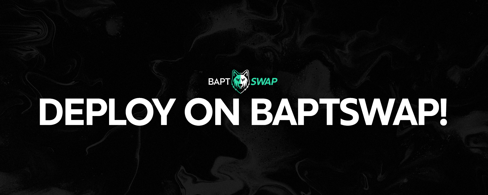

# Create Your Own Token

<figure><figcaption></figcaption></figure>

## Introduction

Baptswap offers a unique zero-code tool to launch tokens with fee-on-transfer support. This guide provides a step-by-step process for token deployment on Baptswap.

## Deploying Your Token


As of October 2023, it's important to note that **tokens deployed using other Token Deployer Tools on the Aptos** blockchain **may not be compatible with** Baptswap's **fee-on-transfer feature**.&#x20;

These tokens **can still be traded on Baptswap**, but they will function as standard tokens **without additional fee capabilities**.


## Advantages of Using Baptswap

Deploying your token through Baptswap ensures seamless integration with the Baptswap ecosystem, including its unique fee-on-transfer functionality. This is an exclusive feature available only on Baptswap for tokens on the Aptos blockchain.

## Steps to Create a Token

Creating a token on Baptswap is fast and easy. Simply navigate to Baptswap and connect the desired wallet for receiving the Token Admin Rights.&#x20;

1. **Token Information**: Start by connecting your wallet to Baptswap and accessing the Token Deployer Tool. You'll need to define key parameters for your token:
   * Name (e.g., Moon Coin)
   * Symbol (e.g., MOON)
   * Total Supply (e.g., 1 000 000)
   * Decimals (Standard is 8)
2. **Token Deployment**: Execute two transactions:
   * Create a module for initializing the token.
   * Publish/Deploy the token.
   * Note: There will be a nominal network fee on Aptos and a Protocol fee of 1 APT, but the Protocol Fee is set to 0 APT for a limited time.
3. **Admin Panel**: After deployment, manage your token and set fees through the Token Admin Panel.

Congrats, you have now created your own token! To find more information about the token, and to set the token's fees, navigate to the Token Admin Panel.


For developers wishing to deploy directly via code without using the Token Deployer, [click here](https://aptos.dev/tutorials/your-first-coin/).


## Adding Liquidity on Baptswap

To enable trading on the DEX, add liquidity to your token through Baptswap's Liquidity page.

Once liquidity is added, your token becomes available for trading on Baptswap.

## Enjoy Your New Environment!

Your token is now live on Baptswap, featuring fee-on-transfer support — a first on the Aptos blockchain!


Note that tokens with LP on multiple exchanges will only support fee-on-transfer on Baptswap.

By adding LP on other exchanges, it can reduce the amount of fees your team can collect from the token's trading volume.


## Support and Assistance

Need help with launching or migrating your token to Baptswap? Connect with us on [Twitter](https://x.com/Baptswap) or [Telegram](https://t.me/baptlabs) for assistance.
