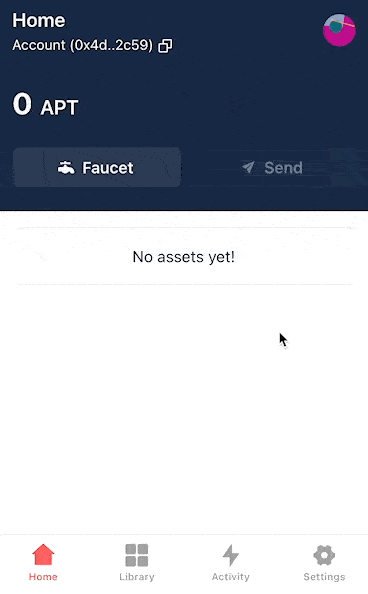
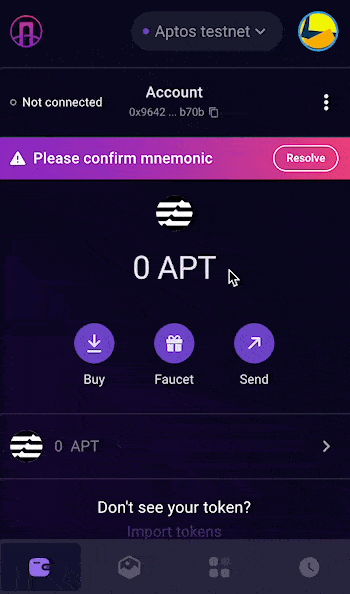
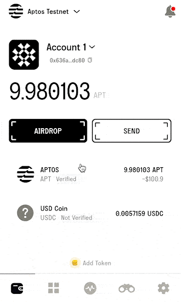
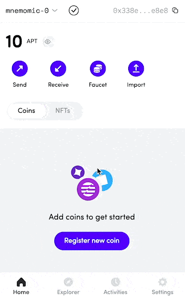

# Connect Your Wallet to Baptswap

<figure><figcaption></figcaption></figure>

## Connect your wallet

<figure><figcaption></figcaption></figure>

1. Click "Connect Wallet" on the top-righthand corner.
2. For most of the browser extension wallets, simple select their icon, and follow the instruction in the pop-up window.


**Remember - NEVER, under any situation, should you ever give someone your private key or recovery phrases.**


## **Connect to Aptos Mainnet**

Aptos has multiple networks, including multiple devnets and testnets. But to use BAPTSWAP on Aptos Chain, please be sure your wallet is connected to **Aptos Mainnet**.&#x20;

Here's how:



<figure><figcaption></figcaption></figure>



<figure><figcaption></figcaption></figure>



<figure><figcaption></figcaption></figure>



<figure><figcaption></figcaption></figure>


